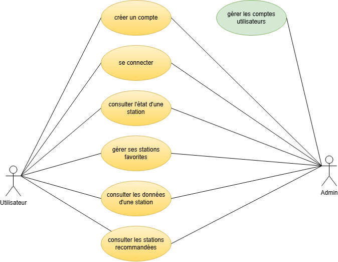
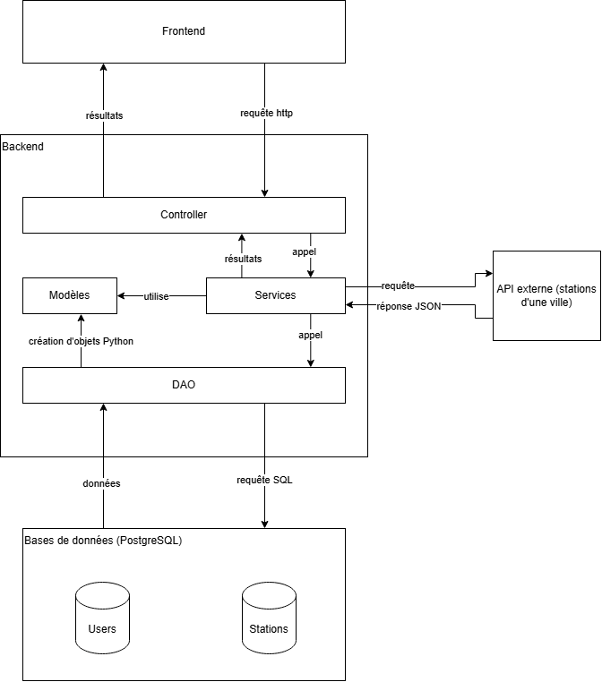

```{=typst}
#import "model.typ": project_template

#show: body => project_template(
  title: [Rapport d'analyse : projet VeloScope],
  team: [Équipe 14],
  authors: ([BONAVERO Méline], [BOYCE Eddy], [CHATONNIER Eliot], [LEJARS Samuel], [MOINERAUD--DOUCET Alix]),
  tutor: [RIVIERE André],
  project: [Projet informatique de 2ème année - Année 2026-2027],
  body
)
```

## Cahier des charges

L'objectif du projet est produire une application donnant des informations sur la disponibilité des vélos dans une ville. Au-delà de la seule disponibilité en temps réel par station, l'application doit également fournir des indicateurs de qualité. Elle donnera notamment un indicateur de fiabilité, qui pourra potentiellement être visualisé grâce à une carte.  

### Utilisateurs  

Deux types d'utilisateurs sont à distingués. Il y aura tout d'abord les utilisateurs «réguliers» de l'application, qui devront créer un compte puis se connecter pour accéder à l'application. Une fois connecté, ils pourront accéder aux données de l'application et gérer leurs stations favorites. Ensuite, il y a aura des comptes «administrateurs» qui pourront gérer les comptes utilisateurs.

### Fonctionnalités de base  

L'application possédera plusieurs fonctionnalités de base. Voici un diagramme de cas d'utilisation, que nous détaillons ci-dessous :  



**Collecter des données via une API**  

La collecte des données concernant la disponibilité et l'état des stations de vélos se fera via une API externe. La collecte se fera à intervalle de temps régulier (toutes 15 min). Elle permettra de nourrir une base de données, hébergée ..., qui contiendra notamment le nom des stations, leurs localisations, leurs états et la disponibilité en terme de vélos et d'emplacement.  

**Consulter des données**  

Les utilisateurs pourront consulter, pour la station de leur choix, diverses informations. Premièrement, les données fournis par l'API (état de fonctionnement, disponibilité). Deuxièmement, des données calculées grâce à l'accumulation des données collectés (taux de remplissage, évolution de la disponibilité, durée moyenne des épisodes de saturation et de pénurie).  

**Fournir un score de fiabilité**

Pour chaque station, l'application calculera et fournira un score de fiabilité. La construction de ce score est détaillée ci-dessous :  

**Recommander une station**  

L'application permettra de recommander des stations à proximité de l'utilisateur. Cette recommandation se basera à la fois sur la distance à l'utilisateur, sur l'historique de station (notamment via le score de fiabilité) et sur son historique récent.  

## Modélisation

### Architecture de l'API  

L'API sera constituée de plusieurs couches afin de repsecter le principe de séparations des responsabilités. Voici un schéma d'ensemble de l'architecture logiciel envisagée, que nous détaillons dans la suite du dossier.



#### Frontend  

Le *frontend* correspond à l'interface homme-machine. Il prendra la forme d'une application interactive accessible via une page Web.  

L'interface se voudra simple et fonctionnelle : elle se présentera sous la forme d'une page HTML. Un menu à gauche permettra à l'utilisateur de sélectionner la fonctionnalité qu'il souhaite. Les différentes fonctionnalités disponibles porteront les noms suivants :  
- rechercher une station,  
- mes stations favorites,  
- recommandation,  
- gérer mon compte,  
- gérer les comptes utilisateurs (n'apparaitra que pour les administrateurs).  

La gestion des stations favorites se fera de la manière suivante : l'utilisateur pourra ajouter de nouvelles stations lors de la consultation de la page d'une station. Il pourra ensuite consulter ses stations favorites ou les supprimer dans l'onglet "mes stations favorites".

#### Backend  

Le *frontend* enverra des requêtes http de la part du *backend*, qui sera chargé de traité ces requêtes et de renvoyer la réponse attendue. Ces requêtes concerneront soit la gestion des utilisateurs (création de compte par exemple), soit la gestion des stations de vélos (consultation de la page d'une station par exemple). Le backend sera séparé en plusieurs couches.  

Tout d'abord, une couche *controller* recevra les requêtes fournies par le frontend lors de l'utilisation de l'API par un usager. Cette couche aura pour but de convertir et transférer ces requêtes à la couche suivante, celles des services.  

La couche *service* est le coeur fonctionnelle de l'API. C'est dans cette couche que seront regrouper les fonctions apportant une valeur ajoutée à notre API. Il s'agira par exemple des fonctions permettant de calculer les indicateurs souhaitées et le score de fiabilité pour chaque station de vélos. Pour cela, la couche *service* a besoin de données. Ces services feront donc appelle à une couche *DAO* (Data Access Object) afin de communiquer avec les bases de données.  

La couche *DAO* recevra les demandes de données de la part de la couche *service*. Elle sera chargée de convertir ces demandes en requêtes SQL. Ces requêtes seront alors traitées par la couche persistente : celle des bases de données. La couche *DAO* aura alors pour mission de convertir en objets python (par exemple en objet *Utilisateur* ou *Station*, cf la section "Modèle de données" pour plus de détails). Ces objets seront ensuite utilisés par la couche service afin de calculer les indicateurs qui seront transmis à la couche *controller* afin de les afficher à l'utilisateur dans l'interface.  

#### Couche persistente  

La couche persistente sera constituée des bases de données qu'utilisera notre API. Deux bases de données sont prévues : l'une pour les données utilisateurs, l'autre pour les données accumulées sur les stations de vélos.  

#### Outils de développement  

Le projet sera réalisé en Python. Nous utiliserons plusieurs outils et packages fournis pour ce langage. Voici le détail de ces outils pour chaque couche :  
- le framework ```streamlit``` pour le *frontend* (afin de construire l'application Web interactive),  
- le framework ```FastAPI``` pour le *backend*,  
- le package ```psycopg2``` pour la couche *DAO* (afin de convertir les instructions Pythopn en requêtes lisibles par les tables PostgreSQL).  

De plus, afin de garantir une maintenance aisée, nous tenterons de respecter les bonnes pratiques de codage tant que faire se peut. Dans ce but, nous serons amenés à utiliser les outils suivants :  
- Ruff pour le formatage du code,  
- Pytest afin d'effectuer les tests unitaires,  
- Github pour héberger et versionner notre projet.  

### Classes  

D'après l'architecture logicielle, le projet nécessitera plusieurs types de classes. Tout d'abord, il faudra implémenter les objets métiers "Users", "Station", et "StationRecord". Chacun de ces objets nécessitera une classe DAO propre afin de pouvoir faire la correspondance entre ces objets et les tables de données correspondantes. Il faut également implémenter des classes controller permettant de gérer les différents endpoints de l'API. Voici un diagramme de classes résumant l'architecture envisagée :

[diagramme classe]

Chacune des trois classes métiers prévues aura une classe "service" associée. Pour les classes "Users" et "StationRecord", les services permettront essentiellement de faire la jonction entre la couche "controller" et la couche "DAO" : ce seront donc des services purement techniques. La réelle plus-value de l'API se fera au niveau de la classe "StationService". Les méthodes de cette classe permettront notamment de récupérer les informations concernant une station et de calculer les différents indicateurs attendus par le cahier des charges. compute_score, score de fiabilité, évolution de la disponibilité (graphique ?) avec choix des périodes, pourcentage de temps passé vide et saturé, durée moyenne des épisodes de saturations et pénurie  

### Modèle de données  

Ce projet nécessite la gestion de deux bases de données :  
- la première est celle des données qui concernent les utilisateurs,  
- la seconde est celle des données qui concernent les stations de vélos.  

Afin que le modèle de données soit cohérent et pérenne, nous veillerons à respecter, pour chaque base de données, les trois premières formes normales.  

#### Base de données des utilisateurs  

Afin de stocker les données des utilisateurs tout en respectant les trois formes normales, une seule table de données sera nécessaire. Elle contiendra les données des utilisateurs : identifiant, pseudonyme de l'utilisateur, mot de passe hashé, statut (utilisateur simple ou administrateur)
[diagramme UML de la table]

#### Base de données des stations de vélos  

L'un des objectifs est de pouvoir aisément transposer l'API à différentes villes. Ainsi, les données conservées doivent être le plus génériques possibles. Les API consultées fournissent les données suivantes : identifiant et nom de la station, coordonnées géographiques, état de la station, nombre d'emplacements, nombre d'emplacements libres, nombre de vélos disponibles (potentiellement électriques), date et heure. Le stockage des données au cours du temps nécessite d'être attentif aux formes normales. En effet, un stockage naïf des données nécessiterait une clé composite (id_station, date, heure). Cela créerait plusieurs problèmes :  
- l'attribut nom_station serait en dépendance fonctionnelle avec id_station et donc avec seulement une partie de la clé primaire (contradiction avec le principe de la deuxième forme normale) ;  
- l'attribut coordonnees_geo serait en dépendance fonctionnelle avec nom_station (contradiction avec le principe de la troisième forme normale).

La base de données des stations possédera deux tables de données. La première sera la relation **station**. Ses attributs stockeront les données concernant les stations elles-mêmes : l'identifiant de la station (clé primaire), son nom et ses coordonnées géoégrpahiques. La seconde sera la relation **enregistrements**, dont les attributs stockeront les données fournies par les API externes. Voici les données stockées : l'identifiant de la station (attribut ```id_station```), date et heure de l'enregistrement (attribut ```date```), le nombre d'emplacements de la station (```nb_emplac```), le nombre d'emplacements libre de la station (```nb_emplac_lib```), le nombre de vélos disponibles (```nb_velos_dispo```) et le nombre de vélos électriques disponibles(```nb_evelos_dispo```).  

[Diagramme UML avec les données suivantes :] 

### Description des endpoints

endpoints utilisateurs:
consulter une station
ajouter une station en favori
obtenir la liste des stations
afficher les stations recommandées
créer un compte
se connecter
ajouter une station en favori
supprimer une station des favoris


endpoints pour administrateur :
changer un mdp
changer un nom utilisateur
supprimer utilisateur

Commande http GET(récupération)/PUT(mis à jour)/POST(insertion)/DELETE(suppression)/PATCH

## Calendrier prévisionnel

diagramme de Gantt




## Annexes {.unnumbered}


