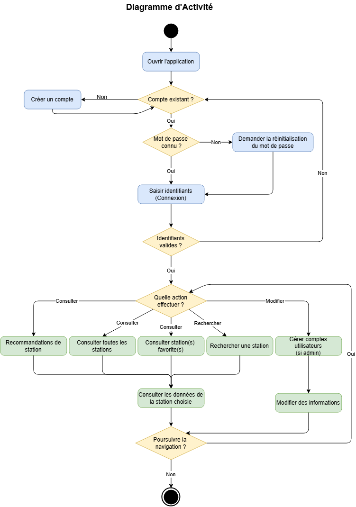
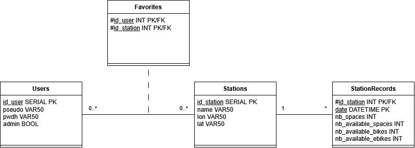
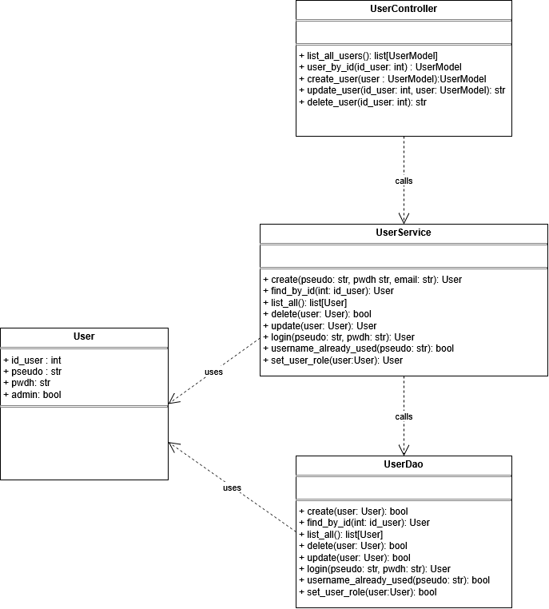
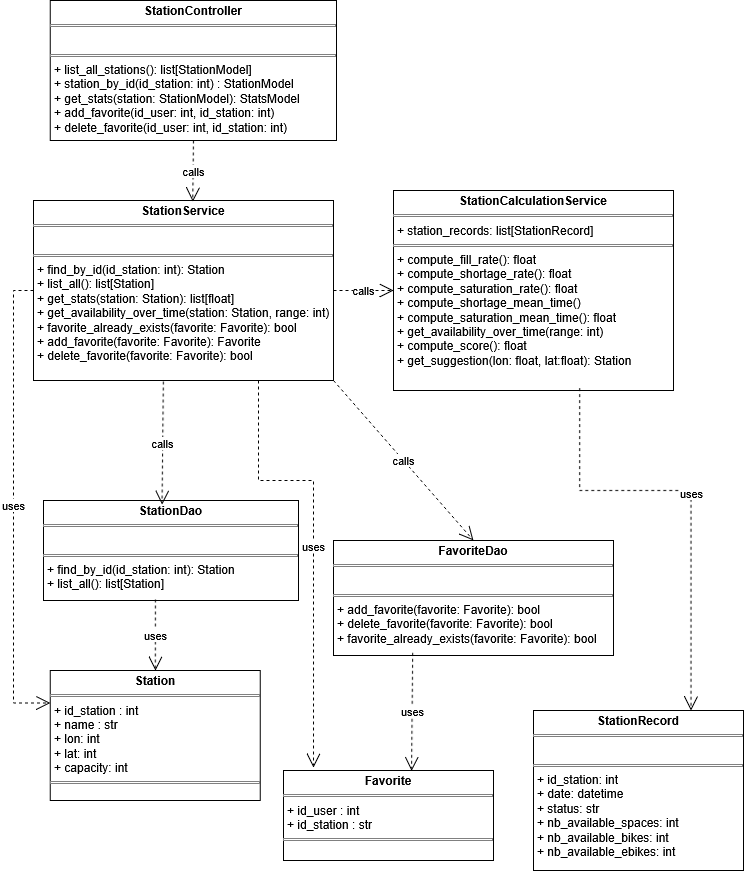
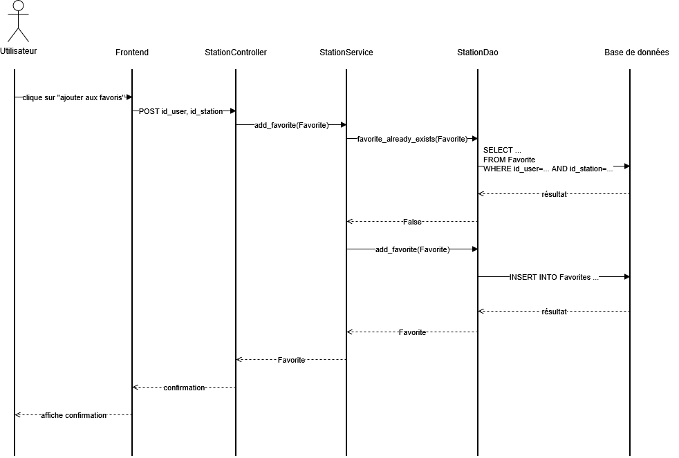

```{=typst}
#import "model.typ": project_template

#show: body => project_template(
  title: [Rapport d'analyse : projet VeloScope],
  team: [Équipe 14],
  authors: ([BONAVERO Méline], [BOYCE Eddy], [CHATONNIER Eliot], [LEJARS Samuel], [MOINERAUD--DOUCET Alix]),
  tutor: [RIVIERE André],
  project: [Projet informatique de 2ème année - Année 2026-2027],
  body
)
```

## Introduction  

Le développement des mobilités douces est un axe majeur face au dérèglement climatique. Parmi les moyens de transports les plus utilisés actuellement figure le vélo. Cependant, l'accès à son propre vélo peut-être rendu difficile par différents facteurs socio-économiques (augmentation des prix face à une forte demande, amélioration technologique des vélos électriques lourd et cher, réduction des surfaces habités par les ménages empêchant le stockage de son vélo personnel). C'est pourquoi toutes les villes se dotent de vélos en libre service, dont la gestion des stations est primordiale. Si de nombreuses applications existent déjà pour connaître l'état des stations de vélos en libre service, elles sont sujettes à de nombreux points faibles. Par exemple, elles ne permettent en effet de ne connaître que l'état actuel, et ne permettent pas de prévoir les disponibilités, même dans un futur proche. C'est pourquoi notre client souhaite développer une API qui irait bien plus loin. Elle permettrait d'étudier les stocks des différentes stations au cours du temps, et ainsi de connaître l'état des stations de manière fine. Elle permettrait aux usagers de pouvoir anticiper leur déplacement via des indicateurs d'évolution temporels et des recommandations adaptées.  

## Cahier des charges

L'objectif du projet est de produire une application donnant des informations sur la disponibilité des vélos dans une ville. Au-delà de la seule disponibilité en temps réel par station, l'application doit également fournir des indicateurs de qualité. Elle donnera notamment un indicateur de fiabilité, qui pourra potentiellement être visualisé grâce à une carte.  

### Utilisateurs  

Deux types d'utilisateurs sont à distingués. Il y aura tout d'abord les utilisateurs «réguliers» de l'application, qui devront créer un compte puis se connecter pour accéder à l'application. Une fois connectés, ils pourront accéder aux données de l'application et gérer leurs stations favorites. Ensuite, il y a aura des comptes «administrateurs» qui pourront gérer les comptes utilisateurs.

### Fonctionnalités de base attendues  

Le cahier des charges prévoit un minimum de fonctionnalités attendues. La @fig-cas_utilisation résume les actions que pourront effectuer les utilisateurs. Nous détaillons ces fonctionnalités par la suite.  

{#fig-cas_utilisation}   

**Collecter des données via une API**  

La collecte des données concernant la disponibilité et l'état des stations de vélos se fera via une API externe. La collecte se fera à intervalle de temps régulier (toutes 15 min). Elle permettra de nourrir une base de données, hébergée ..., qui contiendra notamment le nom des stations, leurs localisations, leurs états et la disponibilité en terme de vélos et d'emplacement.  

**Consulter des données**  

Les utilisateurs pourront consulter, pour la station de leur choix, diverses informations. Premièrement, les données fournis par l'API (état de fonctionnement, disponibilité). Deuxièmement, des données calculées grâce à l'accumulation des données collectés (taux de remplissage, évolution de la disponibilité, durée moyenne des épisodes de saturation et de pénurie).  

**Fournir un score de fiabilité**  

Pour chaque station, l'application calculera et fournira un score de fiabilité, traduisant sa capacité à répondre de manière constante aux besoins des usagers. Ces derniers doivent donc pouvoir emprunter un vélo (station non vide) et le rendre (station non saturée). Pour évaluer cette fiabilité de façon pertinente, on s’appuie sur l'historique des états de la station sur une période donnée. Ce score intègre deux dimensions principales : la fréquence d'indisponibilité, mesurée par le pourcentage de temps passé à l'état vide ou saturé, et la durée moyenne des épisodes de pénurie ou de saturation. L'idée est donc de sanctionner la durée des pannes tout autant que leur fréquence, pour que l'application puisse mettre en avant les stations réellement fiables au quotidien.

Pour traduire cette logique mathématiquement, nous avons construit un score sur 100 points. Cette échelle présente l'avantage d'être intuitive pour l'utilisateur final lors de la recommandation de trajets. La formule sera établie par la suite, mais elle tiendra compte des variables suivantes :  
- les pourcentages de temps passé vides ($Pvide$) et saturés ($Psat$),  
- les durées moyennes des épisodes de saturation ($Msat$) et de pénurie ($Mvide$).  

La formule prévue est de la forme suivante :  
$score = max(0, 100 - f(Pvide ; Psat ; Msat ; Mvide))$  
où $f$ sera une fonction croissante en chacune de ses variables que nous construirons ultérieurement durant la phase de développement du projet.  

**Recommander une station**  

L'application permettra de recommander des stations à proximité de l'utilisateur. Cette recommandation se basera à la fois sur la distance à l'utilisateur, sur l'historique de station (notamment via le score de fiabilité) et sur son historique récent.  

### Déroulé de la navigation  

La @fig-activite montre le diagramme d'activité résumant les étapes de navigation dans l'API.

{#fig-activite}   

**Gestion de compte**  

La première partie de ce diagramme correspond à la partie de gestion de compte de l'utilisateur. Elle lui permet de créer un compte si il en a pas, de modifier son mot de passe en cas d'oubli ou bien de se connecter à son compte. Seul l'administrateur dispose après connexion à son compte de la possibilité d'influer sur les comptes des utilisateurs "réguliers".

**Fonctionnalité principales**  

L'ensemble des fonctionnalités de l'application sont dans la deuxième partie de ce diagramme. L'ensemble des options (recommandations, liste, favoris et recherches) mènent à la consultation des données liées à une seule station. L'utilisateur a ensuite le choix de quitter l'application ou de poursuivre la navigation en retournant à l'étape du choix d'action.  

## Modélisation  

### Architecture de l'API  

L'API sera constituée de plusieurs couches afin de repsecter le principe de séparations des responsabilités. L'architecture logiciel envisagée est présentée dans la @fig-archi-log.

{#fig-archi-log}  

#### Frontend  

Le *frontend* correspond à l'interface homme-machine. Il prendra la forme d'une application interactive accessible via une page Web.  

L'interface se voudra simple et fonctionnelle : elle se présentera sous la forme d'une page HTML. Un menu à gauche permettra à l'utilisateur de sélectionner la fonctionnalité qu'il souhaite. Les différentes fonctionnalités disponibles porteront les noms suivants :  
- rechercher une station,  
- mes stations favorites,  
- recommandation,  
- gérer mon compte,  
- gérer les comptes utilisateurs (n'apparaitra que pour les administrateurs).  

La gestion des stations favorites se fera de la manière suivante : l'utilisateur pourra ajouter de nouvelles stations lors de la consultation de la page d'une station. Il pourra ensuite consulter ses stations favorites ou les supprimer dans l'onglet "mes stations favorites".

#### Backend  

Le *frontend* enverra des requêtes http de la part du *backend*, qui sera chargé de traité ces requêtes et de renvoyer la réponse attendue. Ces requêtes concerneront soit la gestion des utilisateurs (création de compte par exemple), soit la gestion des stations de vélos (consultation de la page d'une station par exemple). Le backend sera séparé en plusieurs couches.  

Tout d'abord, une couche *controller* recevra les requêtes fournies par le frontend lors de l'utilisation de l'API par un usager. Cette couche aura pour but de convertir et transférer ces requêtes à la couche suivante, celles des services.  

La couche *service* est le coeur fonctionnelle de l'API. C'est dans cette couche que seront regrouper les fonctions apportant une valeur ajoutée à notre API. Il s'agira par exemple des fonctions permettant de calculer les indicateurs souhaitées et le score de fiabilité pour chaque station de vélos. Pour cela, la couche *service* a besoin de données. Ces services feront donc appelle à une couche *DAO* (Data Access Object) afin de communiquer avec les bases de données.  

La couche *DAO* recevra les demandes de données de la part de la couche *service*. Elle sera chargée de convertir ces demandes en requêtes SQL. Ces requêtes seront alors traitées par la couche persistente : celle des bases de données. La couche *DAO* aura alors pour mission de convertir en objets python (par exemple en objet *Utilisateur* ou *Station*, cf la section "Modèle de données" pour plus de détails). Ces objets seront ensuite utilisés par la couche service afin de calculer les indicateurs qui seront transmis à la couche *controller* afin de les afficher à l'utilisateur dans l'interface.  

#### Couche persistente  

La couche persistente sera constituée des bases de données qu'utilisera notre API. Deux bases de données sont prévues : l'une pour les données utilisateurs, l'autre pour les données accumulées sur les stations de vélos.  

### Modèle de données  

Afin que le modèle de données soit cohérent et pérenne, nous veillerons à respecter les trois premières formes normales. 

Concernant les utilisateurs, une table "Users" sera nécessaire. Elle contiendra les données des utilisateurs : identifiant, pseudonyme de l'utilisateur, mot de passe hashé, statut (utilisateur simple ou administrateur). 

Pour les stations, les données à stocker sont les suivantes : identifiant et nom de la station, coordonnées géographiques, état de la station, nombre d'emplacements, nombre d'emplacements libres, nombre de vélos disponibles (potentiellement électriques), date (avec heure). Le stockage des données au cours du temps nécessite d'être attentif aux formes normales. En effet, un stockage naïf des données nécessiterait une clé composite (```id_station```, ```date```). Cela créerait plusieurs problèmes :  
- l'attribut ```name_station``` serait en dépendance fonctionnelle avec ```id_station``` et donc avec seulement une partie de la clé primaire (contradiction avec le principe de la deuxième forme normale) ;  
- les attributs de coordonnées géographiques ```lon``` et ```lat``` seraient en dépendance fonctionnelle avec ```name_station``` (contradiction avec le principe de la troisième forme normale).  
Il faudra donc deux tables. La première sera la relation **Stations**. Ses attributs stockeront les données concernant les stations elles-mêmes : l'identifiant de la station (clé primaire), son nom et ses coordonnées géoégrpahiques. La seconde sera la relation **StationRecords**, dont les attributs stockeront les données fournies par l'API externe. Voici les données stockées : l'identifiant de la station (attribut ```id_station```), date et heure de l'enregistrement (attribut ```date```), le nombre d'emplacements de la station (```nb_spaces```), le nombre d'emplacements libre de la station (```nb_available_spaces```), le nombre de vélos disponibles (```nb_available_bikes```) et le nombre de vélos électriques disponibles(```nb_available_ebikes```).  

Enfin, l'un des attendus du projet est de permettre aux utilisateurs de pouvoir gérer leurs stations favorites. Cela se fera via une table d'association "Favorite" qui permettra de lier un utilisateur à ses stations favorites.  

Le modèle de données est résumé en @fig-modele_donnees.

{#fig-modele_donnees}   

### Classes  

#### Généralités  

D'après l'architecture logicielle, le projet nécessitera différents types de classes. Tout d'abord, il faudra implémenter les classes modèles ```User```, ```Station```, et ```StationRecord``` et ```Favorite``` qui modéliseront respectivement un utilisateur, une station, un enregistrement de station à une date précise et la liaison entre entre une utilisateur et ses stations favorites. Chacune de ces classes nécessitera une classe DAO propre afin de pouvoir faire la correspondance entre ces objets et les tables de données correspondantes. Il faudra également implémenter des classes controller permettant de gérer les différents endpoints de l'API. Enfin, chacune des quatre classes métiers prévues aura une classe de services associée. Elles traiteront les objets Python correspondant.  

**Remarque :** Afin de ne pas surcharger les diagrammes ci-dessous inutilement, ne figureront pas :
- les classes schémas de type "BaseModel", utilisés par les controllers et qui permettront de faire la traduction entre les objets Python et les informations au format JSON envoyés ou reçus par le frontend;  
- les méthodes spéciales (du type ```__str__```, etc.) qui pourraient être nécessaires.  

#### Classes liées aux utilisateurs  

Les classes liées aux utilisateurs permettront essentiellement de créer les utilisateurs et de gérer leur rôle (utilisateur ou administrateur). La classe modèle est la classe ```User```. Les autres classes seront essentiellement fonctionnelles et permettront de gérer la connexion et la base de données. Le diagramme de classes prévu lié aux utilisateurs est présenté en @fig-classes-user.   

{#fig-classes-user}   

#### Classes liées aux stations  

Trois classes modèles liées aux stations sont prévues. Tout d'abord, la classe ```Station``` modélisera une station et dont les attributs stockeront les informations d'une station. Ensuite, la classe ```Favorite``` modélisera le lien entre une utilisateur et le fait qu'une station soit en favori. Enfin, une classe ```StationRecord``` qui modélisera l'état d'une station à un heure donnée, et dont les attributs seront les informations fournies par l'API externe de la ville.  

Chacune des trois classes métiers prévues possédera une classe DAO, une classe de services et une classe controller (exceptée la classe ```StationRecord```, car l'appel à l'API externe se fera via la méthode ```get_data``` de la classe ```StationRecordService```). Deplus, afin de séparer la logique métier et les calculs des indicateurs statistiques, le choix a été fait de créer une autre classe service : la classe ```StationCalculationService```. Les méthodes de cette classe seront appelées par la méthode ```get_stats``` de la classe ```StationService``` et permettront de retourner les indicateurs souhaités par le cahier des charges. Pour rappels, les indicateurs attendus sont les suivants : taux de remplissage, disponibilité au cours du temps, pourcentage du temps passé vide ou saturé, temps moyen des épisodes de saturation et de pénurie, score de fiabilité. Une méthode ```get_availability_over_time``` est prévue, afin de déterminer l'évolution de la disponibilité de la station. Selon le développement et les possibilités, elle retournera des graphiques (à l'aide de la bibliothèque matplotlib) ou des tableaux de données.  

Le diagramme de classes prévu lié aux stations est présenté en @fig-classes-station.  

{#fig-classes-station}   

### Description des endpoints  

Les tableaux suivants décrivent les différents endpoints prévus de l'API.  

#### Comptes et authentification  

| Chemin | Méthode | Entrée | Sortie (succès) | Description |
| :---- | :---- | :---- | :---- | :---- |
| `/create_user` | POST | `username`, `password`, `email` | `User` | Crée un compte |
| `/login` | POST | `username`, `password` | jeton d'accès | Authentifie et renvoie un jeton |
| `/users` | GET | - | `liste[User]` | Liste les comptes |
| `/users/{id_user}` | PATCH | `username` et/ou `password` | `User` | Modifie un compte |
| `/users/{id_user}` | DELETE | - | - | Supprime un compte |  

**Remarque :** les trois derniers endpoints du tableau précédent ne seront accessibles qu'aux comptes *administrateurs*.  

#### Stations  

| Chemin | Méthode | Entrée | Sortie (succès) | Description |
| :---- | :---- | :---- | :---- | :---- |
| `/stations` | GET | - | `liste[Station]` | Liste les stations |
| `/stations/{id_station}` | GET | - | `Station` | État actuel d'une station + indicateurs statistiques + score |
| `/stations/{id_station}/history` | GET | période (24h/7j/30j) | `liste[Releve]` | Évolution de la disponibilité |
| `/suggestions` | GET | position géographique | `liste[Station]` | Stations recommandées en fonction des critères |  

#### Gestion des stations favorites  

| Chemin | Méthode | Entrée | Sortie (succès) | Description |
| :---- | :---- | :---- | :---- | :---- |
| `/favorites` | GET | - | `liste[Station]` | Favoris de l'utilisateur courant |
| `/favorites/{station_id}` | PUT | - | - | Ajoute une station aux favoris |
| `/favorites/{station_id}` | DELETE | - | - | Retire une station des favoris |  

### Diagramme de séquence d'une fonctionnalité  

On présente en @fig-sequence le diagramme de séquence de la fonctionnalité "ajouter une station favorite", afin de visualiser le lien entre les différentes couches. Ce diagramme traite du cas où la station n'est pas déjà en favori.

{#fig-sequence} 

## Organisation du projet  

### Calendrier prévisionnel  

diagramme de Gantt

### Outils de développement  

Le projet sera réalisé en Python. Durant la phase de développement, nous utiliserons plusieurs outils et bibliothèques fournis pour ce langage. Voici le détail de ces outils pour chaque couche :  
- le framework ```streamlit``` pour le *frontend* (afin de construire l'application Web interactive),  
- le framework ```FastAPI``` pour le *backend*,  
- la bibliothèque ```psycopg2``` pour la couche *DAO* (afin de convertir les instructions Pythopn en requêtes lisibles par les tables PostgreSQL),  
- la bibliothèque ```pydantic``` pour les classes schémas.  


De plus, afin de garantir une maintenance aisée, nous tenterons de respecter les bonnes pratiques de codage. Dans ce but, nous serons amenés à utiliser les outils suivants :  
- Ruff pour le formatage du code,  
- Pytest afin d'effectuer les tests unitaires,  
- Github pour héberger et versionner notre projet.  


<!--

## Annexes {.unnumbered}


 -->
